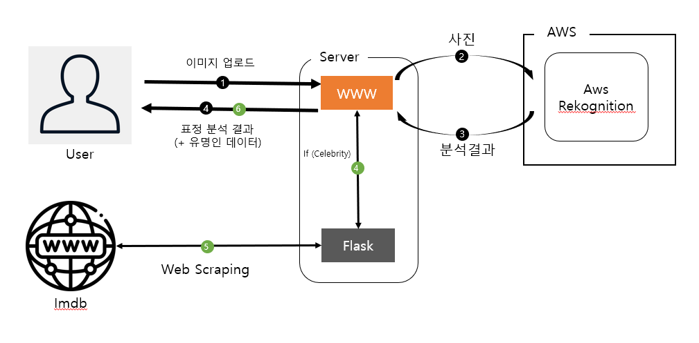

# 클라우드컴퓨팅 텀프로젝트

## A. 프로젝트 명

얼굴 분석해드려요
  

## B. 프로젝트 멤버

전병준 : 팀장 및 개발 및 디자인 등등... 1인 개발
  

## C. 프로젝트 소개 및 개발 내용 소개

AWS의 Rekognition를 이용해 사진의 표정분석 및 유명인 데이터를 받아 React로 웹사이트를 구축
  

## D. 프로젝트 개발 결과물 소개

[최종 결과물] 

최종 결과물은 웹사이트를 하나 만들었다.

사이트에서 사진을 업로드하면 해당 사진의 표정을 분석해 어떤 감정을 드러내는지 예측한 데이터를 보여준다.

만약 해당 인물이 유명인이라면 출연작으로는 무엇이 있는지 추가로 확인할 수 있다.
  

[다이어그램] 

기본적인 흐름은 1 -> 2 -> 3-> 4 를 따라가게 된다.

만일 '3'에서 넘어온 분석결과에 유명인이라는 정보가 포함되어 있다면, 로컬에서 자체적으로 동작중이던 Flask 서버에 Rest API 형식으로 데이터를 전송해 Imdb 라는 사이트를 웹크롤링을 해오게 된다.
  

## E. 개발 결과물을 사용하는 방법

1. 사이트에 접속한다. 접속하면 위와 같은 페이지가 나타나게 된다.
2. 다음으로 '사진 표정 분석'이라는 버튼을 누른다.

3. 그럼 다음과 같은 페이지를 보게 되고 앞에 보이는 버튼을 눌러 사진을 업로드한다.

4. 사진을 올리면 결과확인이라는 버튼과 올린 사진의 썸네일이 나타나게 된다.

5. 결과버튼 확인을 누르면 해당 이미지에 대한 표정 분석 결과가 나오고, 유명인이라면 그의 출연작 리스트도 위 쪽의[최종 결과물]과 같이 출력되게 된다.

  

## F. 개발 결과물의 필요성 및 활용방안

해당 사이트를 통해 사용자들은 얼마 안되는 시간이지만, 시간을 죽일 수 있고  
이름 모르는 배우의 사진을 통해 해당 배우의 출연작들을 확인할 수 있게 된다.

  

## 참고자료

base64 to bytes : https://docs.aws.amazon.com/ko_kr/rekognition/latest/dg/image-bytes-javascript.html

Flask : https://rekt77.tistory.com/104

Cors 문제 : https://flask-cors.readthedocs.io/en/latest/

CORS 정의 : https://developer.mozilla.org/ko/docs/Web/HTTP/CORS

React 미리보기 : https://gaemi606.tistory.com/39

UI 전반 : https://material-ui.com/

티머니 둥근바람 폰트 : https://noonnu.cc/font_page/458

EC2 + nginx + react : https://medium.com/@bdv111/aws-ec2%EC%97%90%EC%84%9C-nginx%EB%A1%9C-react-%EC%95%B1-%EC%A7%81%EC%A0%91-%EB%B0%B0%ED%8F%AC%ED%95%98%EA%B8%B0-c1e09639171e

그 외 도움을 준 박찬영씨에게 감사드립니다.
